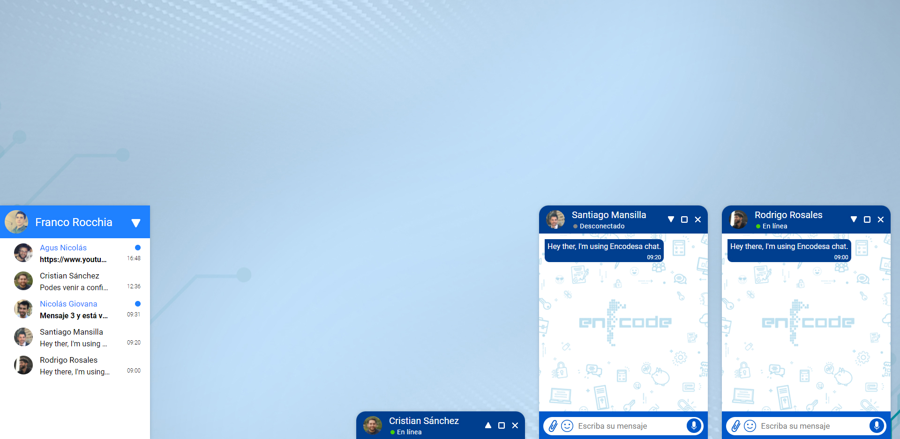

# HANGOUTS CLONE

<!--  -->

<!--  &nbsp; -->
 &nbsp;
 &nbsp;
[]()

<!-- ANGULAR BADGE -->
<!--  -->




>Esta app hecha con React fue uno de mis primeros proyectos, es una imitación de la interfaz de usuario (UI) de hangouts.

&nbsp;

## Pre-requisitos 💻 

Antes de comenzar, verifica que cumplas con los siguiente:

* Estar utilizando Windows como sistema operativo.
* Tener instalado NodeJS
* Tener instalado Git.


&nbsp;

## Instalando 🔧

Abre tu consola en la ubicación donde quieras clonar el repositorio:

```bash
# Clona el repositorio
$ git clone https://github.com/rammcodes/dopefolio

# Entra a la carpeta del repositorio
$ cd dopefolio

# Instala todas las dependencias
$ npm install
```

&nbsp;


## ☕ Usando Hangouts clone

Usando NPM:

```bash
# Ejecuta la aplicación
$ npm run start
```

Listo! La una nueva pestaña se abrirá en tu navegador preestablecido, la aplicación estará corriendo en la url http://localhost:3000, ahora puedes interactuar con la interfaz, enviar mensajes y algunas cosas más.


<br>


## 😄 Muchas gracias<br>

Gracias por llegar hasta aquí, si te gustó este proyecto no te olvides de darme una estrella ⭐. Podes entrar a mi [perfíl](https://github.com/francodder) de GitHub y ver otros proyectos de mi portafolio en los que estoy trabajando, también podes contactarme a mi correo fran.rocchia@gmail.com 
<br>
<br>

Que tengas un buen día!

<br/>

<p>
  <a href="https://www.linkedin.com/in/franco-rocchia/" target="_blank" rel="nofollow noreferrer">
     LinkedIn
  </a> &nbsp; 
</p>